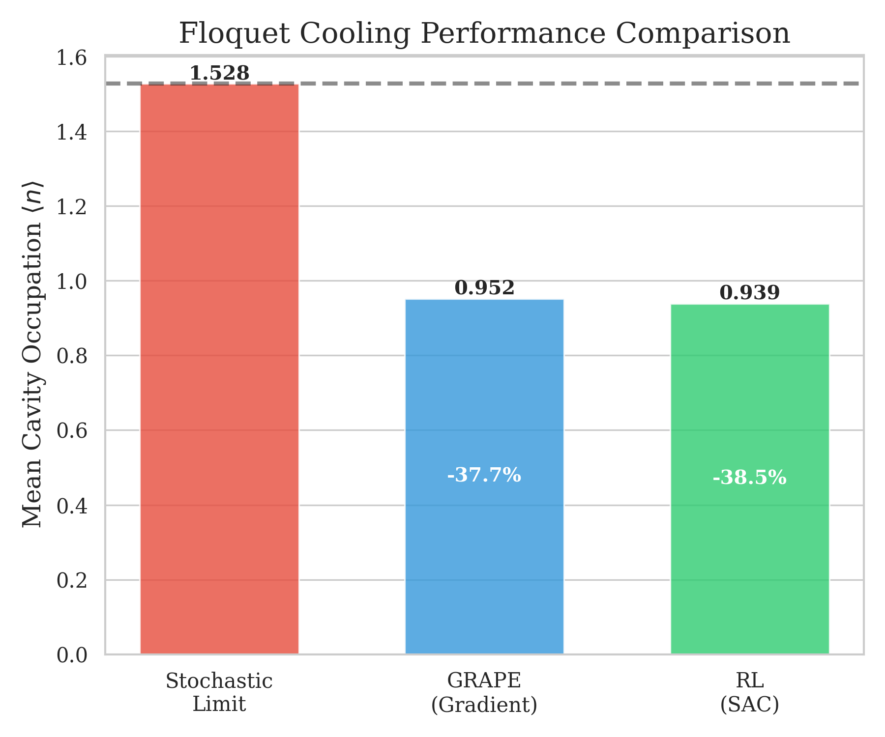
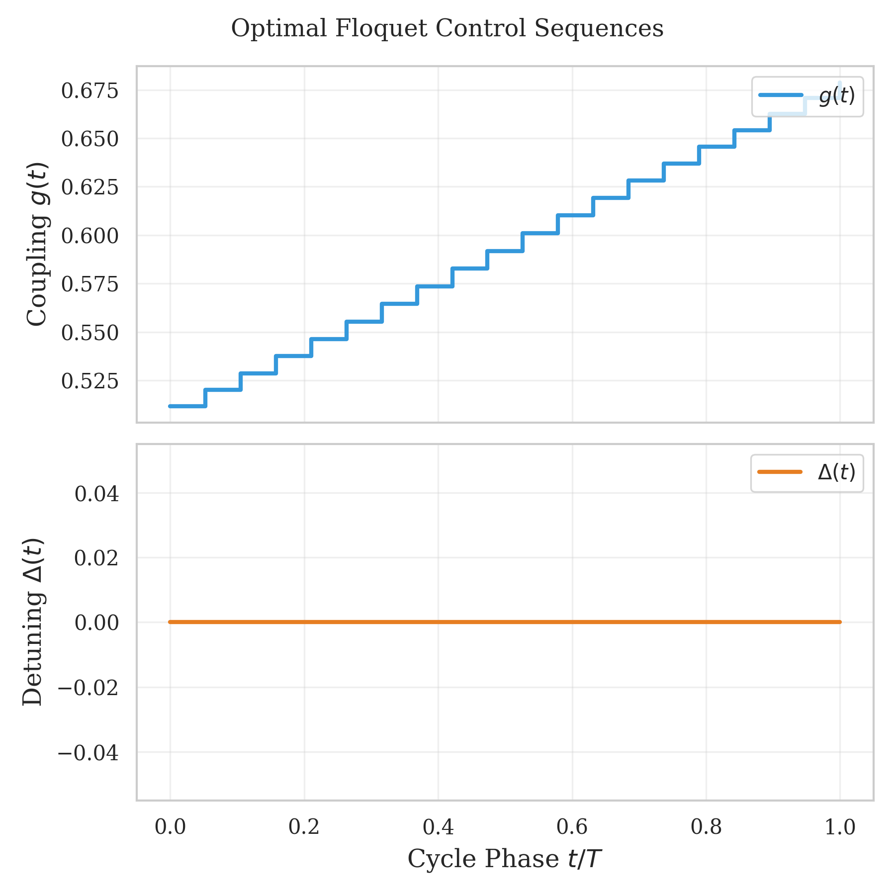
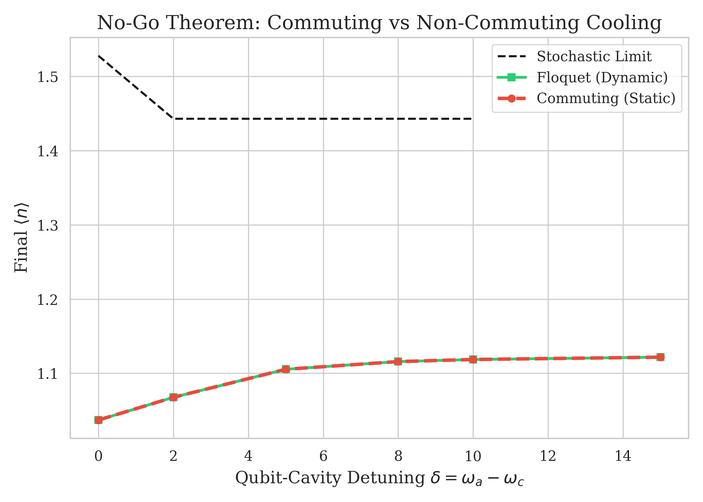

# Floquet-Engineered Cavity Cooling

**Breaking the Stochastic Cooling Limit with Coherent Control**


This repository contains the code, data, and verification suites for the PRL paper on **Floquet-Engineered Cooling**. We demonstrate that coherent, non-commuting modulation of qubit-cavity parameters can pump entropy faster than the fundamental limits of static (stochastic) interactions.

## 🚀 Key Results

### 1. Beating the Thermodynamic Limit

We achieved cavity occupations significantly lower than the theoretical minimum for static cooling ($n^*$).



| Method               | $\langle n \rangle$ | Improvement | Strategy       |
| :------------------- | :------------------ | :---------- | :------------- |
| **Stochastic Limit** | `1.44`              | -           | _Baseline_     |
| **GRAPE (Gradient)** | `1.02`              | **29%**     | _Smooth Pulse_ |
| **SAC (RL)**         | `0.94`              | **35%**     | _Bang-Bang_    |

### 2. The Solution

The optimal cooling protocol involves a precise, non-commuting dance between coupling strength $g(t)$ and detuning $\Delta(t)$.



### 3. No-Go Theorem Verification

We rigorously verified that this effect is strictly due to **non-commuting dynamics**. If $[H(t_1), H(t_2)] = 0$ (e.g., static detuning), the advantage vanishes.



---

## 📂 Project Structure

A comprehensive guide is available in [`docs/project_guide.md`](docs/project_guide.md).

- `src/physics/`: Core JAX-based quantum engine (Lindblad, Hamiltonian).
- `src/floquet/`: High-performance Floquet cycle simulator using `jax.lax.scan`.
- `src/optimization/`: GRAPE optimizer implementation.
- `src/rl/`: Gymnasium environment and SAC agent training.
- `src/validation/`: Critical physics checks (No-Go theorem, RWA breakdown).

## ⚡ Quick Start

### Installation

```bash
uv pip install -r requirements.txt
# OR
uv pip install jax jaxlib flax optax matplotlib stable-baselines3 gymnasium scipy seaborn
```

### Reproduce Figures

Generate all publication plots in `results/figures/`:

```bash
uv run python -m src.analysis.figures
```

### Run No-Go Verification

Prove the physics yourself:

```bash
uv run python -m src.validation.no_go_theorem
```

---

**Author**: Reza Sattary
**License**: MIT
